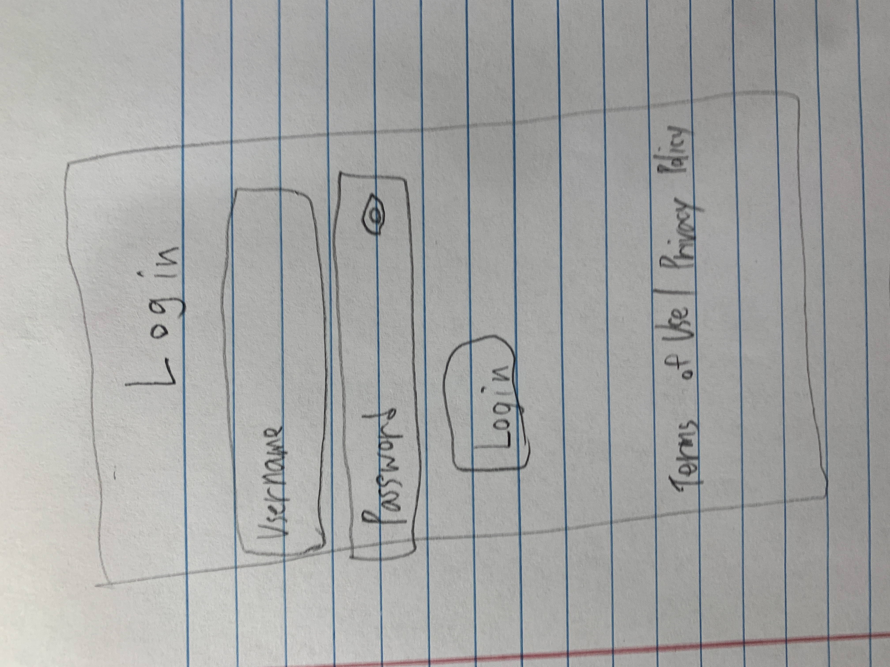
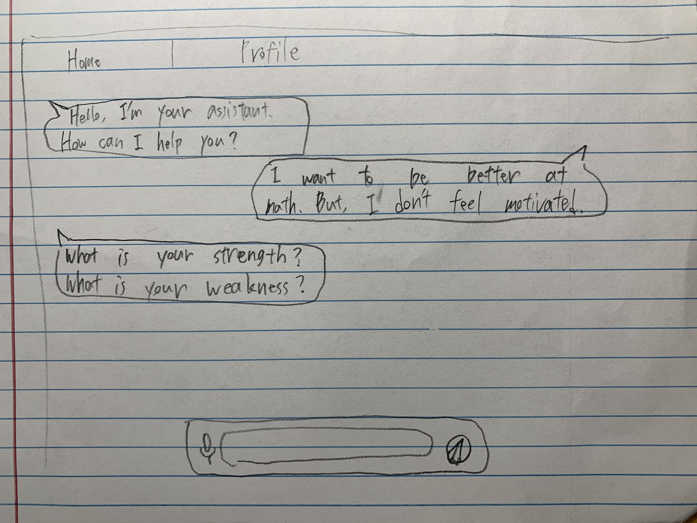
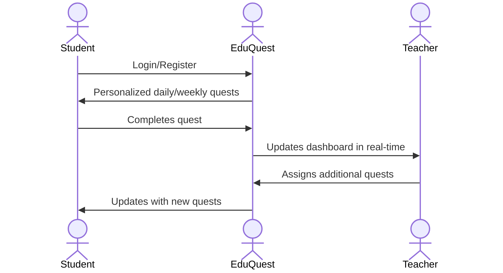

# EduQuest

EduQuest is an interactive educational platform that provides students with personalized quests to strengthen their learning. The system uses Large Language Models (LLMs) to create weekly and daily quests tailored to each student’s strengths, weaknesses, interests, and learning styles. Teachers can also monitor and support student growth through the platform.

## 🚀 Specification Deliverable

For this deliverable I did the following. I checked the box `[x]` and added a description for things I completed.

- [x] Proper use of Markdown
- [x] A concise and compelling elevator pitch
- [x] Description of key features
- [x] Description of how you will use each technology
- [x] One or more rough sketches of your application. Images must be embedded in this file using Markdown image references.

### Elevator pitch

EduQuest is an interactive educational platform that transforms learning into personalized quests. By leveraging AI, it dynamically creates weekly and daily challenges tailored to each student’s strengths, weaknesses, and learning style. Students stay motivated through gamified progress, while teachers gain insights into their growth and can assign extra challenges. EduQuest empowers learners to grow step by step while keeping teachers connected in real time.

### Design

Login

Chat Interface

### Key features

- Login / Registration System: Secure authentication for students and teachers.
- Personalized Quests: Daily and weekly quests generated using AI based on user profile.
- Real-time Updates: WebSocket integration for live quest completion tracking.
- Interactive Frontend: Built with React for responsive and modular UI.
- Teacher Dashboard: Monitor student progress and assign tasks.
- Third-Party API Integration: Enriches educational experience through external APIs.

### Technologies

I am going to use the required technologies in the following ways.

- **HTML** - Defines the structure of pages such as login, quests, and dashboards.
- **CSS** - Styles components with a modern responsive layout and animations.
- **React** - Handles routing, user interactions, and modular UI components.
- **Service** - Provides RESTful endpoints for authentication, quest generation, and progress tracking.
- **DB/Login** - Stores user profiles, quests, and authentication credentials securely.
- **WebSocket** - Sends real-time updates when students complete quests or teachers assign tasks.

## 🚀 AWS deliverable

For this deliverable I did the following. I checked the box `[x]` and added a description for things I completed.

- [ ] **Server deployed and accessible with custom domain name** - [My server link](https://yourdomainnamehere.click).

## 🚀 HTML deliverable

For this deliverable I did the following. I checked the box `[x]` and added a description for things I completed.

- [x] **HTML pages** - Pages for login, quests, and progress.
- [x] **Proper HTML element usage** - Semantic elements used for accessibility.
- [x] **Links** - Navigation links between login, chat, and profile.
- [x] **Text** - Placeholder text for login and chat.
- [x] **3rd party API placeholder** - Example API placeholder integrated.
- [x] **Images** - Logo and quest icons.
- [x] **Login placeholder** - Placeholder login form.
- [x] **DB data placeholder** - Example user data from DB.
- [x] **WebSocket placeholder** - Mock quest update in real-time.

## 🚀 CSS deliverable

For this deliverable I did the following. I checked the box `[x]` and added a description for things I completed.

- [ ] **Header, footer, and main content body** - I did not complete this part of the deliverable.
- [ ] **Navigation elements** - I did not complete this part of the deliverable.
- [ ] **Responsive to window resizing** - I did not complete this part of the deliverable.
- [ ] **Application elements** - I did not complete this part of the deliverable.
- [ ] **Application text content** - I did not complete this part of the deliverable.
- [ ] **Application images** - I did not complete this part of the deliverable.

## 🚀 React part 1: Routing deliverable

For this deliverable I did the following. I checked the box `[x]` and added a description for things I completed.

- [ ] **Bundled using Vite** - I did not complete this part of the deliverable.
- [ ] **Components** - I did not complete this part of the deliverable.
- [ ] **Router** - I did not complete this part of the deliverable.

## 🚀 React part 2: Reactivity deliverable

For this deliverable I did the following. I checked the box `[x]` and added a description for things I completed.

- [ ] **All functionality implemented or mocked out** - I did not complete this part of the deliverable.
- [ ] **Hooks** - I did not complete this part of the deliverable.

## 🚀 Service deliverable

For this deliverable I did the following. I checked the box `[x]` and added a description for things I completed.

- [ ] **Node.js/Express HTTP service** - I did not complete this part of the deliverable.
- [ ] **Static middleware for frontend** - I did not complete this part of the deliverable.
- [ ] **Calls to third party endpoints** - I did not complete this part of the deliverable.
- [ ] **Backend service endpoints** - I did not complete this part of the deliverable.
- [ ] **Frontend calls service endpoints** - I did not complete this part of the deliverable.
- [ ] **Supports registration, login, logout, and restricted endpoint** - I did not complete this part of the deliverable.

## 🚀 DB deliverable

For this deliverable I did the following. I checked the box `[x]` and added a description for things I completed.

- [ ] **Stores data in MongoDB** - I did not complete this part of the deliverable.
- [ ] **Stores credentials in MongoDB** - I did not complete this part of the deliverable.

## 🚀 WebSocket deliverable

For this deliverable I did the following. I checked the box `[x]` and added a description for things I completed.

- [ ] **Backend listens for WebSocket connection** - I did not complete this part of the deliverable.
- [ ] **Frontend makes WebSocket connection** - I did not complete this part of the deliverable.
- [ ] **Data sent over WebSocket connection** - I did not complete this part of the deliverable.
- [ ] **WebSocket data displayed** - I did not complete this part of the deliverable.
- [ ] **Application is fully functional** - I did not complete this part of the deliverable.
